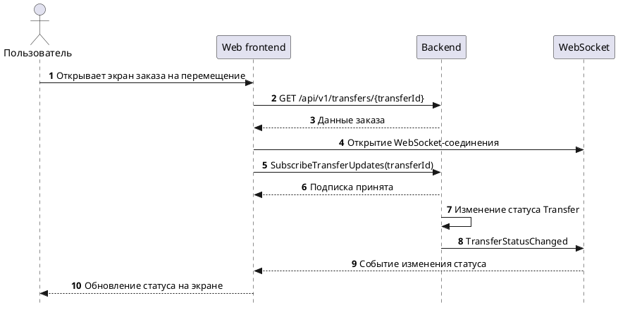

# Проектирование асинхронного взаимодействия

## Выбранный сценарий

Для проектируемой системы в качестве асинхронного взаимодействия выбрано **уведомление веб-клиента о смене статуса заказа на перемещение вещи между локациями**.

Этот сценарий хорошо подходит под асинхронный формат, потому что после создания заказа процесс не завершается сразу. Сначала заказ ожидает оплаты и назначения курьера, затем вещь забирают из исходной ячейки, перевозят между локациями и помещают в целевую ячейку.

Сервер не может вернуть итоговый результат сразу в ответ на HTTP-запрос, потому что статус заказа меняется уже в ходе дальнейшего выполнения процесса.

## Почему взаимодействие асинхронное

Перемещение вещи между локациями является длительным процессом.

В процессе могут происходить разные изменения статуса:

- заказ создан;
- ожидается оплата;
- ожидается назначение курьера;
- курьер назначен;
- вещь забрана;
- вещь находится в пути;
- вещь размещена в целевой ячейке;
- перемещение завершено;
- заказ отменён;
- возник инцидент.

Пользователю важно видеть актуальный статус на экране заказа на перемещение. При этом постоянное обновление страницы или частый polling создавали бы лишнюю нагрузку на backend и ухудшали бы пользовательский опыт.

## Выбранная технология

Для реализации взаимодействия выбран **WebSocket**.

WebSocket подходит для данного сценария, потому что:

- MVP реализуется как веб-платформа;
- пользователю нужно получать обновления статуса в интерфейсе почти в реальном времени;
- соединение между клиентом и сервером может оставаться открытым;
- backend может отправлять событие сразу после изменения статуса;
- для UI-ориентированного real-time сценария WebSocket проще и уместнее, чем брокеры сообщений или gRPC-streams.

RabbitMQ, Kafka, NATS и другие брокеры сообщений могут быть полезны для внутреннего взаимодействия между backend-сервисами, но для прямого уведомления веб-клиента в рамках MVP они избыточны.

## Средство описания контракта

Так как сообщения передаются в формате JSON, контракт описан с помощью **AsyncAPI**.

В спецификации описаны:

- WebSocket-сервер;
- канал для событий по перемещениям;
- команда клиента для подписки на конкретный `transferId`;
- событие backend о смене статуса перемещения;
- структуры сообщений;
- допустимые значения статусов перемещения.

Ссылка на спецификацию в AsyncAPI Studio:

[https://studio.asyncapi.com/?share=f18debd3-5885-4b9e-b0bc-67096d3685a5](https://studio.asyncapi.com/?share=f18debd3-5885-4b9e-b0bc-67096d3685a5)

## Исходный файл спецификации

Файл спецификации доступен в репозитории документации:

- [AsyncAPI.yaml](/files/asyncapi/AsyncAPI.yaml)

## Логика взаимодействия

1. Пользователь открывает экран заказа на перемещение.
2. Frontend получает текущие данные заказа через REST API.
3. Frontend открывает WebSocket-соединение.
4. Frontend отправляет команду подписки на обновления по конкретному `transferId`.
5. Backend сохраняет подписку в рамках активного соединения.
6. При изменении статуса заказа backend отправляет событие `TransferStatusChanged`.
7. Frontend получает событие и обновляет статус на экране пользователя.

## Канал взаимодействия

В спецификации используется WebSocket endpoint:

```text
wss://api.example.com/ws
```

Канал:

```text
/transfers
```

Клиент подписывается на обновления по конкретному заказу на перемещение через сообщение `SubscribeTransferUpdates`.

Backend отправляет событие `TransferStatusChanged` при каждом изменении статуса заказа на перемещение.

## Сообщение подписки

Клиент отправляет сообщение подписки на обновления по конкретному перемещению.

```json
{
  "action": "subscribe",
  "transferId": "550e8400-e29b-41d4-a716-446655440000"
}
```

Поля сообщения:

| Поле | Тип | Описание |
| ---- | --- | -------- |
| `action` | string | Тип клиентской команды. Для подписки используется значение `subscribe` |
| `transferId` | uuid | Идентификатор заказа на перемещение |

## Событие изменения статуса

Backend отправляет событие `TransferStatusChanged`, когда статус заказа на перемещение меняется.

```json
{
  "eventType": "TRANSFER_STATUS_CHANGED",
  "transferId": "550e8400-e29b-41d4-a716-446655440000",
  "bookingId": "7d9f4f61-2c4a-4c4d-9b0a-8af3b8f7a111",
  "previousStatus": "IN_TRANSIT",
  "newStatus": "PLACED_IN_TARGET_CELL",
  "changedAt": "2026-05-04T12:00:00Z",
  "actorType": "COURIER",
  "comment": "Вещь размещена в целевой ячейке"
}
```

Поля события:

| Поле | Тип | Описание |
| ---- | --- | -------- |
| `eventType` | string | Тип события. Для изменения статуса используется `TRANSFER_STATUS_CHANGED` |
| `transferId` | uuid | Идентификатор заказа на перемещение |
| `bookingId` | uuid | Идентификатор связанного бронирования |
| `previousStatus` | string | Предыдущий статус заказа |
| `newStatus` | string | Новый статус заказа |
| `changedAt` | date-time | Дата и время изменения статуса |
| `actorType` | string | Источник изменения статуса |
| `comment` | string | Дополнительный комментарий, например причина инцидента |

## Статусы заказа на перемещение

В событии используются статусы жизненного цикла `Transfer`:

| Статус | Значение |
| ------ | -------- |
| `CREATED` | Заказ создан |
| `WAITING_FOR_PAYMENT` | Ожидается оплата |
| `WAITING_FOR_COURIER_ASSIGNMENT` | Ожидается назначение курьера |
| `COURIER_ASSIGNED` | Курьер назначен |
| `ITEM_PICKED_UP` | Вещь забрана из исходной ячейки |
| `IN_TRANSIT` | Вещь находится в пути |
| `PLACED_IN_TARGET_CELL` | Вещь размещена в целевой ячейке |
| `COMPLETED` | Перемещение завершено |
| `CANCELED` | Заказ отменён |
| `INCIDENT` | Возник инцидент |

## Источник изменения статуса

Поле `actorType` показывает, кто или что инициировало изменение статуса.

| Значение | Описание |
| -------- | -------- |
| `SYSTEM` | Статус изменён автоматически системой |
| `COURIER` | Статус изменён на основании действия курьера |
| `SUPPORT` | Статус изменён сотрудником поддержки |

## Sequence diagram



## Итоговое решение

Для MVP выбран сценарий уведомления веб-клиента о смене статуса заказа на перемещение.

Итоговая схема решения:

| Элемент | Решение |
| ------- | ------- |
| Сценарий | Уведомление о смене статуса заказа на перемещение |
| Технология | WebSocket |
| Формат сообщений | JSON |
| Контракт | AsyncAPI 3.1.0 |
| Команда клиента | `SubscribeTransferUpdates` |
| Событие backend | `TransferStatusChanged` |
| Основной идентификатор подписки | `transferId` |
