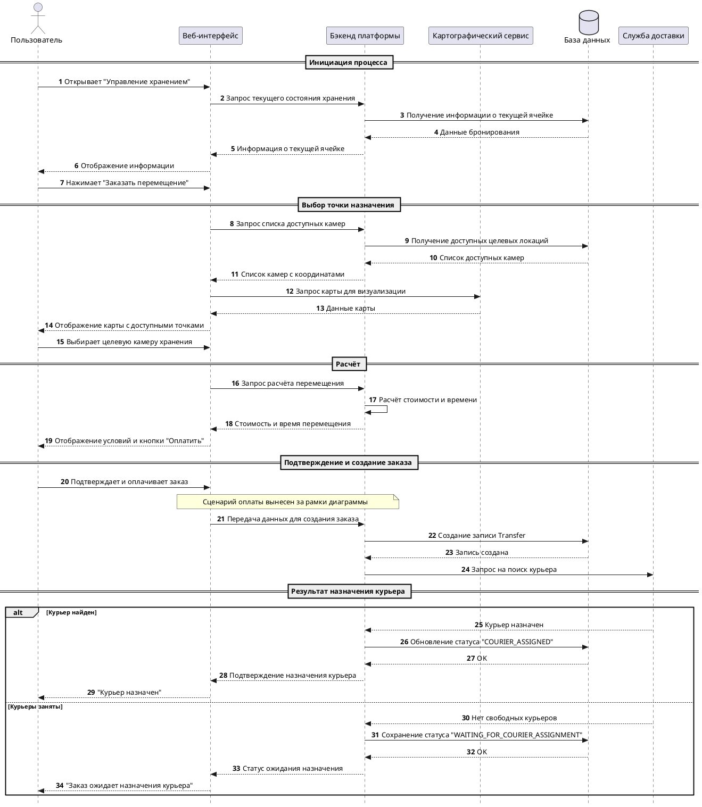
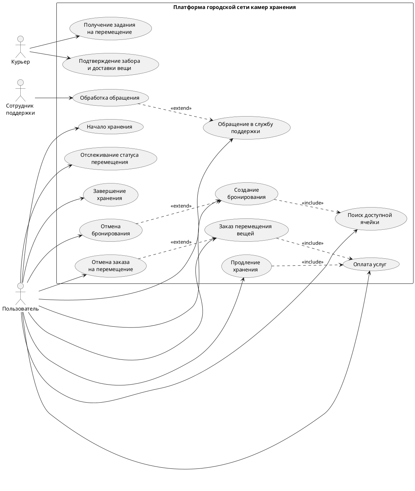

# UML-диаграммы

В данном разделе представлены UML-диаграммы, подготовленные для проекта **«Платформа городской сети камер хранения с возможностью доставки вещей между локациями»**.

В рамках артефакта используются:

- **Use Case diagram** – для описания основных акторов и вариантов использования системы;
- **Sequence diagram** – для описания сценария оформления перемещения вещи между локациями.

## Sequence diagram

Диаграмма последовательности описывает сценарий оформления заказа на перемещение вещи между камерами хранения.

Сценарий начинается с открытия пользователем раздела управления хранением, затем система получает данные текущего хранения, показывает доступные целевые локации, рассчитывает параметры перемещения и создаёт заказ. Сценарий оплаты вынесен за рамки диаграммы, так как платёжный контур описывается отдельно.

## Use Case diagram

Use Case-диаграмма показывает основные роли и пользовательские сценарии платформы.

В финальной упрощённой модели выделяются три основных актора:

- **Пользователь** – работает с хранением, перемещением, оплатой и поддержкой;
- **Курьер** – получает задание на перемещение и подтверждает выполнение этапов доставки;
- **Сотрудник поддержки** – обрабатывает обращения пользователей.

## Пояснение к диаграммам

### Sequence diagram

Диаграмма отражает основной сценарий оформления перемещения вещи. В ней показаны следующие участники:

| Участник | Роль |
| -------- | ---- |
| Пользователь | Инициирует перемещение вещи |
| Веб-интерфейс | Отображает данные и передаёт действия пользователя в backend |
| Бэкенд платформы | Выполняет бизнес-логику, расчёты и изменение статусов |
| Картографический сервис | Предоставляет данные карты для отображения целевых локаций |
| База данных | Хранит данные бронирований, ячеек и заказов на перемещение |
| Служба доставки | Получает запрос на назначение курьера |

Сценарий оплаты вынесен за рамки диаграммы, так как платёжный процесс описывается отдельно через интеграцию с платёжной платформой.

### Use Case diagram

Use Case-диаграмма отражает основные действия акторов в системе. В неё включены сценарии пользователя, курьера и сотрудника поддержки.

Основные сценарии пользователя:

- поиск доступной ячейки;
- создание бронирования;
- начало хранения;
- продление хранения;
- заказ перемещения вещей;
- оплата услуг;
- отслеживание статуса перемещения;
- завершение хранения;
- отмена бронирования;
- отмена заказа на перемещение;
- обращение в службу поддержки.

Основные сценарии курьера:

- получение задания на перемещение;
- подтверждение забора и доставки вещи.

Основной сценарий сотрудника поддержки:

- обработка обращения пользователя.
